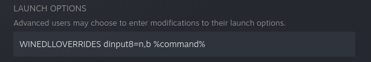

# Patch Sekiro under Linux
Inspired by https://github.com/uberhalit/SekiroFpsUnlockAndMore
## Quickstart
Download the latest release, or build it yourself.
### Usage
#### Set the maximum FPS
```sh
./sekirofpsunlock 30 set-fps 144
```
#### Set the resolution
```sh
./sekirofpsunlock 30 set-resolution 2560 2560 1080
```
#### Set resolution and maximum FPS in a single command
```sh
./sekirofpsunlock 30 set-resolution 2560 2560 1080 set-fps 144
```
#### Starting from Steam
You can optionally have this patcher run when you click "PLAY" in Steam. To
accomplish that, set the game's launch options like so:
```
/home/user/sekirofpsunlock 30 set-resolution 2560 2560 1080 set-fps 144 & %command%
```
Make sure to replace `/home/user/sekirofpsunlock` with the full path to the
program. Also make sure there is a single ampersand (`&`) between the program
call and `%command%`. Omitting it will cause the patcher to timeout and the
game won't run. Having two (`&&`) will cause the patcher to timeout and the
game will probably not run!
### Notes
#### Game frozen
The patcher may leave the game frozen. If you're starting the patcher from Steam or before the game starts, you'll notice because Steam will show you as playing, but the game won't start no matter how long you wait. You can verify that this happened by running:
``` sh
grep State /proc/$(pgrep sekiro.exe)/status
```
If the game is frozen, the output will be:
```
State:  T (stopped)
```
In that case, you can unfreeze the game with:
``` sh
kill -SIGCONT $(pgrep sekiro.exe)
```
I'm not quite sure why this happens. Detaching from the process should unfreeze it, but sometimes it does not.
#### set-fps succeeds, but the max FPS does not change
This means that something else is limiting the FPS. You can probably solve it by grabbing `dxvk.conf` from the release tarball or the `contrib` directory in this repository and dropping it into the game's folder. You will need to restart the game for the changes to take effect.
## Slowstart
This is the old quickstart, it goes into more detail. If you have any issues it's possible that reading this section may help with finding the solution. If not, you can open an issue and I may be able to help you.
### Usage
```sh
./sekirofpsunlock <timeout-seconds> <argument> {<argument>}
```
It will look for the game and then patch it according to the arguments you
provide. You can run it before the game starts, or while the game is running.

`<timeout-seconds>` is an integer value, denoting how long the program can
wait before failing while:
- Searching for the game.
- Searching for a memory pattern.

You should set it to the time it takes from clicking "PLAY" in Steam to the
game window appearing, plus some extra to be safe. 30 is a reasonable value
for most, so it will be used in the examples. Don't set it to absurdly high
values (at most 100 should be enough, if your game takes longer than that
to start and unpack, you probably have some issue with your PC), since the
program busy-loops looking for the process and memory patterns. This
effectively occupies a whole CPU thread while it is running.
#### Set max FPS
```sh
./sekirofpsunlock <timeout-seconds> set-fps <max-fps>
```
For example:
```sh
./sekirofpsunlock 30 set-fps 144
```
#### Set the resolution
```sh
./sekirofpsunlock <timeout-seconds> set-resolution <display-width> <game-width> <game-height>
```
For example:
```sh
./sekirofpsunlock 30 set-resolution 2560 2560 1080
```
`<display-width>` refers to the viewport that the game will run in, windowed
or not. It doesn't necessarily have to a display, can also be a gamescope
instance, in that case it should be equal to gamescope's `--output-width`
argument.

If you patch the resolution while the game is running (instead of starting
the program before starting the game), the resolution patch will not apply
immediately, you'd have to force a display mode change. This can be done by
switching the resolution or changing the windowing mode in the game settings.
You can then simply switch back and the custom resolution will persist.

Note: you will only be able to set the resolution once, subsequent attempts
will fail. As things are currently, you'd need to restart the game to try a
different resolution. It's possible to have it working, but I don't see why
anyone would want to set the resolution more than once per play session, so
I didn't bother implementing it.
##### UI issues
###### 21:9

There's a reason the game forces 16:9 aspect ratio: the UI elements are not designed for other aspect ratios! For 21:9, you can use [Ultrawide UI Fixes](https://www.nexusmods.com/sekiro/mods/240). The install steps under Linux are quite simple:
- Install [Sekiro Mod Engine](https://www.nexusmods.com/sekiro/mods/6). Download, unpack and put the two files (`dinput8.dll` and `modengine.ini`) to Sekiro's game folder.
- Download [Aspect Ratio 21 x 9 main file](https://www.nexusmods.com/sekiro/mods/240?tab=files), move menu folder into the folder named `mods` in Sekiro's game folder.

After these steps, your Sekiro game folder should like something like this:
```
...
sekiro.exe
dinput8.dll
modengine.ini
mods
mods/menu
mods/menu/01_000_fe.gfx
mods/menu/01_002_fe_saveicon.gfx
mods/menu/01_061_talk.gfx
mods/menu/01_200_dyingeffect.gfx
mods/menu/01_201_stealtheffect.gfx
mods/menu/01_210_dead.gfx
mods/menu/01_250_tutorialmessage.gfx
mods/menu/01_251_tutorialmsgdialog.gfx
mods/menu/01_900_black.gfx
mods/menu/01_910_fade.gfx
mods/menu/02_210_fullscreenmsgdialog.gfx
mods/menu/02_280_getitem.gfx
mods/menu/02_281_getitem_middle.gfx
mods/menu/02_282_getitem_high.gfx
mods/menu/02_283_getitem_skill.gfx
mods/menu/02_284_getitem_event.gfx
mods/menu/02_290_menututorial.gfx
mods/menu/02_903_nowloading2.gfx
mods/menu/02_904_nowloading3.gfx
mods/menu/03_200_shoptop.gfx
mods/menu/03_202_bonfire.gfx
mods/menu/05_000_title.gfx
mods/menu/05_900_logo_fromsoft.gfx
```
The last step is actually activating the mod loader. It is loaded through `dinput8.dll`, but by default Wine will use its own version, not the one in the game folder. To get Wine to actually use it, you need to set a DLL override. With Steam, this is easy to do: set the launch options to `WINEDLLOVERRIDES=dinput8=n,b %command%`.

###### 16:10
Unfortunately, there is no mod that fixes the UI for 16:10, so Steam Deck users are out of luck. The game is still perfectly playable with patched resolution, of course, but the UI will be a little bit off.
#### Combined
```sh
./sekirofpsunlock 30 set-resolution 2560 2560 1080 set-fps 144
```
The order can also be opposite:
```sh
./sekirofpsunlock 30 set-fps 144 set-resolution 2560 2560 1080
```
But it's recommended that you keep `set-resolution` first.
## Building
```sh
meson build -Db_ndebug=if-release -Dbuildtype=release
ninja -C build
```
The resulting `sekirofpsunlock` file will be in the `build` directory.
