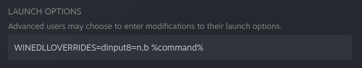

# Patch Sekiro under Linux
Inspired by https://github.com/uberhalit/SekiroFpsUnlockAndMore
## Quickstart
### Building
```sh
git clone https://github.com/Lahvuun/sekirofpsunlock.git
cd sekirofpsunlock
make
```
### Change the framelock from 60 to a different value
Usage:
``` sh
./sekiro-set-fps <pid> <fps>
```
For example, to get the pid in a subshell and set framelock to 120:
``` sh
./sekiro-set-fps $(pidof sekiro.exe) 120
```
### Set a custom resolution
``` sh
./sekiro-set-resolution <pid> <screen-width> <game-width> <game-height>
```
For example, with a screen (viewport) at 2560x1080 and game running in full screen:
``` sh
./sekiro-set-resolution $(pidof sekiro.exe) 2560 2560 1080
```
This will only take effect once the game sets its display mode. It can happen in two ways:
- Automatically, when the game is started.
- Triggered by the player, when changing resolution or windowing mode.

In the first case, you can patch the game before it first sets the display mode (indeed, this is what SekiroFpsUnlockAndMore does under Windows). To make this easier, I provided a script that will wait until a process called sekiro.exe is present and then execute the patcher you provided to it:
``` sh
./wait-and-patch.sh ./sekiro-set-resolution 2560 2560 1080
```
Start the script before you run the game. Once it's running, the script will run the patcher and exit.

If you want to go with the second option, simply change to a different resolution and then back, or switch to windowed and back to full screen.
#### UI issues
##### 21:9

There's a reason the game forces 16:9 aspect ratio: the UI elements are not designed for other aspect ratios. For 21:9, you can use [Ultrawide UI Fixes](https://www.nexusmods.com/sekiro/mods/240). The install steps under Linux are quite simple:
- Install [Sekiro Mod Engine](https://www.nexusmods.com/sekiro/mods/6). Download, unpack and put the two files (`dinput8.dll` and `modengine.ini`) to Sekiro's game folder.
- Download [Aspect Ratio 21 x 9 main file](https://www.nexusmods.com/sekiro/mods/240?tab=files), move menu folder into the folder named `mods` in Sekiro's game folder.

After these steps, your Sekiro game folder should like something like this:
```
...
sekiro.exe
dinput8.dll
modengine.ini
mods
mods/menu
mods/menu/01_000_fe.gfx
mods/menu/01_002_fe_saveicon.gfx
mods/menu/01_061_talk.gfx
mods/menu/01_200_dyingeffect.gfx
mods/menu/01_201_stealtheffect.gfx
mods/menu/01_210_dead.gfx
mods/menu/01_250_tutorialmessage.gfx
mods/menu/01_251_tutorialmsgdialog.gfx
mods/menu/01_900_black.gfx
mods/menu/01_910_fade.gfx
mods/menu/02_210_fullscreenmsgdialog.gfx
mods/menu/02_280_getitem.gfx
mods/menu/02_281_getitem_middle.gfx
mods/menu/02_282_getitem_high.gfx
mods/menu/02_283_getitem_skill.gfx
mods/menu/02_284_getitem_event.gfx
mods/menu/02_290_menututorial.gfx
mods/menu/02_903_nowloading2.gfx
mods/menu/02_904_nowloading3.gfx
mods/menu/03_200_shoptop.gfx
mods/menu/03_202_bonfire.gfx
mods/menu/05_000_title.gfx
mods/menu/05_900_logo_fromsoft.gfx
```
The last step is actually activating the mod loader. It is loaded through `dinput8.dll`, but by default Wine will use its own version, not the one in the game folder. To get Wine to actually use it, you need to set a DLL override. With Steam, this is easy to do: set the launch options to `WINEDLLOVERRIDES=dinput8=n,b %command%`.

##### 16:10
Unfortunately, there is no mod that fixes the UI for 16:10, so Steam Deck users are out of luck. The game is still perfectly playable with patched resolution, of course, but the UI will be a little bit off.
